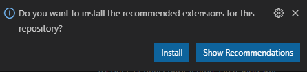
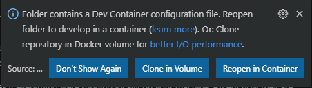
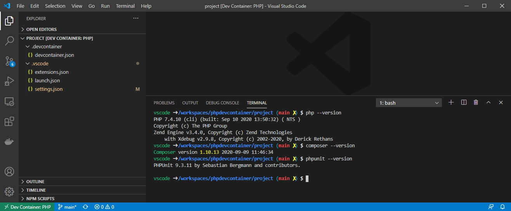

# PHP dev container
All in one php dev container to use with vscode

Find it on the docker hub : https://hub.docker.com/r/jrouaix/phpdevcontainer

``` bash
docker pull jrouaix/phpdevcontainer:latest
```

## Installed in this dev container
- php
- node
- npm
- composer
- ~~phpunit~~ (it's confusing when not install as a composer dependency)
- symfony

# To enjoy a working php environment in VSCode
- copy the `project` folder content at the root of your repository
- open your repo in VSCode
- install the recommended extensions when asked by VSCode



- then VSCode should ask for reopening the folder in dev container
- click on `Reopen in Container` 



- When VSCode reopened in the dev container, you are set to hack with a full php env



# What to do with this environment

## Create a php file and serve
```bash

rm index.php

cat >> index.php << END
<?php
    function sayHello(\$name) {
        echo "Hello \$name!";
    }
?>
<html><body><?php
    \$number=42;
    sayHello('world' . \$number);
    phpinfo(); 
?></body></html>
END

php -S 0.0.0.0:8000

```

## Composer setup & Run some unit tests

There already is some `composer.json` default file and `src/Email.php` & `test/EmailTest.php` examples. 

```bash
composer install
composer dump-autoload
./vendor/bin/phpunit tests
```
Or (if you reopen this dev container)
```bash
composer update
```
# More reading

- https://code.visualstudio.com/docs/remote/containers
- https://github.com/microsoft/vscode-remote-try-php
- https://phpunit.de/getting-started/phpunit-9.html
