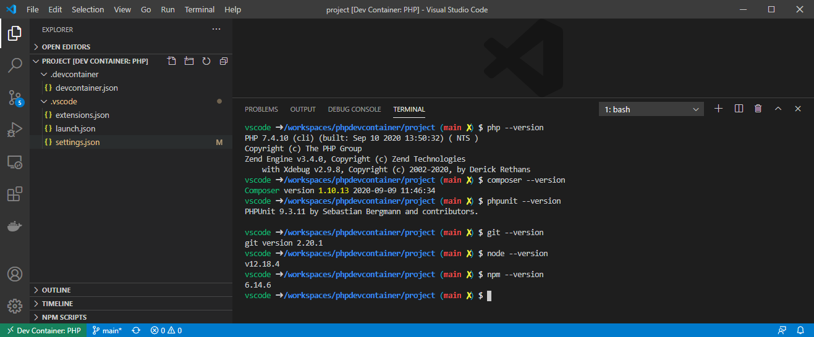

# PHP dev container
All in one php dev container to use with vscode

Find it on the docker hub : https://hub.docker.com/r/jrouaix/phpdevcontainer

``` bash
docker pull jrouaix/phpdevcontainer:latest
```

## Installed in this dev container
- php
- composer
- phpunit
- node
- npm
- symfony

## To enjoy a working php environment in VSCode
- copy the `project` folder content at the root of your repository
- open your repo in VSCode
- install the recommended extensions when asked by VSCode


- then VSCode should ask for reopening the folder in dev container
- click on `Reopen in Container` 


- When VSCode reopened in the dev container, you are set to hack with a full php env



## What to do with this environment


## More reading

- https://code.visualstudio.com/docs/remote/containers
- https://github.com/Microsoft/vscode-remote-try-php

